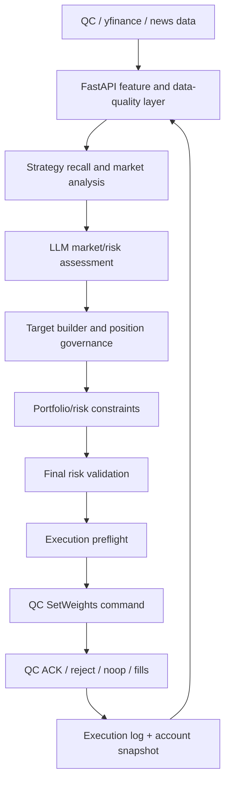

# Recommendation-Style Trading System Architecture Review

> Review draft
> Last updated: 2026-06-06
> Current priority: stabilize the normal live loop before expanding the data compass / ML platform.

---

## Executive Summary

The desired system is best described as:

```text
ETF trading system = recommendation system + portfolio/risk/execution constraints
```

The system should not be a collection of isolated trading scripts. It should be
a robust decision platform:

```text
raw data enters
  -> features are built
  -> strategies recall candidate ETFs
  -> LLM and ranking layers analyze candidates and market risk
  -> portfolio mixer builds executable targets
  -> deterministic risk/execution contracts validate targets
  -> QC executes
  -> execution truth and account state return to FastAPI
```

The current system already implements many parts of this architecture:

- raw data ingestion from QC, yfinance, news, and internal execution logs
- feature/data-quality layers
- strategy and hedge candidate generation
- LLM researcher / bull / bear / cross-exam / synthesizer analysis
- target building, position governance, active basket diagnostics
- execution policy, final risk validation, TargetEnvelope, MutationLedger
- QC command lifecycle, ACK/reconcile, execution logs
- validation observation loop for future calibration

The main near-term goal is not to build a large "data compass" yet. The near
term goal is:

```text
make the normal production loop reliable:
data in -> agent analysis -> target generation -> risk validation
-> command to QC -> QC execution/rejection/noop -> state back to FastAPI
```

Once this loop is stable, the system can gradually add better data, strategies,
ranking, basket optimization, hedge calibration, and eventually ML training.

---

## User Target

The target architecture mirrors a production recommendation system:

### 1. Raw Data Enters the System

Sources include but are not limited to:

- QC account state
- QC holdings
- QC orders, fills, ACKs, rejections, noops
- QC heartbeat and daily snapshots
- OHLCV / adjusted price data
- yfinance historical features
- news and macro context
- internal decision logs
- execution outcomes

The long-term goal is to preserve raw events so future strategies and ML models
can be trained without relying only on derived summaries.

### 2. ETL / Feature Pipeline

Raw data is transformed into point-in-time features:

- returns
- volatility
- momentum
- drawdown
- breadth
- regime
- sentiment
- liquidity/cost proxies
- account freshness
- policy alignment
- execution state

Important requirement:

```text
features must be point-in-time safe
```

No future information should leak into strategy scoring, ranking, or backfilled
labels.

### 3. Strategy Recall Layer

Strategies behave like recall channels in a recommender system.

Each strategy should answer:

```text
Which ETFs deserve attention now, and why?
```

Examples:

- momentum recall
- sector rotation recall
- low-vol / defensive recall
- mean-reversion recall
- hedge / inverse ETF recall
- macro/context recall
- LLM-assisted watchlist recall

The recall layer should not directly produce executable weights. It should
produce structured candidates.

### 4. Ranking / Deep Analysis Layer

The ranking layer evaluates recalled ETF candidates more carefully.

It should consider:

- expected return signal
- confidence
- evidence quality
- market regime fit
- news/context support
- liquidity/cost
- risk budget cost
- thesis state
- conflicts across signals
- LLM market/risk assessment

This is where LLMs can be very valuable. They can analyze complex market
context, summarize risks, identify conflicts, and explain why an ETF deserves
attention or caution.

### 5. Portfolio Mixer / Risk / Holding Management

The mixer converts candidate/ranking results into a portfolio target under
constraints:

- current holdings
- active basket policy
- role caps
- single ticker caps
- cash floor
- min executable weight
- turnover limits
- no-add restrictions
- hard-risk trims
- hedge intent
- position lifecycle
- policy version

This is the trading equivalent of recommendation "mixed ranking", but with
capital, risk, and execution constraints.

### 6. Execution and Feedback

FastAPI sends a validated command to QC. QC is responsible for broker/runtime
truth.

QC returns:

- accepted / rejected / noop
- actual orders
- fills
- holdings after execution
- cash after execution
- open orders
- policy version used
- account snapshot after execution

FastAPI records this result and uses it for the next cycle.

---

## Current Architecture Mapping

| Target Layer | Current Implementation | Status |
|---|---|---|
| Raw data | QC snapshots, account snapshots, yfinance, news cache, execution logs, agent_analysis | Partially implemented |
| Feature pipeline | yfinance features, feature authority, market scorecard, signal validation, data quality detail | Implemented but not fully unified |
| Recall layer | momentum/mean-reversion/low-vol/sector/hedge/playground strategy outputs | Implemented as strategy diagnostics/candidates |
| LLM analysis | researcher, bull, bear, cross-exam, synthesizer | Implemented and actively used |
| Ranking layer | evidence scorecard, strategy confidence, scorecard tightening, LLM thesis | Partially implemented, not yet a unified ranker |
| Mixer | target_builder, position_governance, position_manager, active_basket_policy diagnostics | Strong but still complex |
| Risk validation | risk_manager, final_risk_validation, execution_policy, TargetEnvelope, MutationLedger | Strong |
| Execution | FastAPI command -> QC SetWeights -> ACK/reconcile | Implemented, still stabilizing feedback |
| Outcome loop | validation_observation_loop, execution truth, hedge outcome logs | Started |
| Training data | durable raw/candidate/ranking/outcome event store | Not fully implemented |

---

## Current Production Loop

The current intended live loop is:



The short-term requirement is that this loop runs cleanly during market hours:

- no avoidable LLM failures
- no unknown mutation types
- no stale state after QC ACK
- no duplicate same-target execution
- no unexplained target drift
- no confusing Telegram status

This loop has two kinds of requirements:

```text
liveness = the loop can run when inputs are healthy
safety   = the loop halts safely when state is untrusted
```

P0 work must include both. A trading system that runs often but cannot safely
stop on reconciliation divergence is not production-safe.

---

## What Is Already Working

### Data Entry

Working or partially working:

- QC heartbeat and daily feature snapshots
- `account_state_snapshots`
- yfinance historical data
- holdings factors
- news ingestion and summarization
- execution logs
- strategy reports
- validation observation refresh

Main gap:

```text
raw data is not yet fully normalized into a clean event store.
```

For now, this is acceptable. The current focus is live-loop stability.

### Agent Analysis

Working:

- researcher synthesizes market/news/context into structured analysis
- bull/bear agents create opposing theses
- cross-exam identifies disagreement
- synthesizer creates advisory conclusions
- communicator summarizes operator-facing output

Recent fix:

- `OPENAI_MODEL_HEAVY=gpt-5.4-mini` is now supported through GPT-5-compatible
  Chat Completions parameters.

Important boundary:

```text
LLM is a market/risk analyst, not the executor.
```

LLM should identify market state, risk, conflicts, and candidate concerns.
It must not directly own executable weights.

### Target and Risk Layer

Working:

- `target_builder`
- `position_governance`
- `position_manager`
- `final_execution_policy_cap`
- `active_basket_policy` diagnostics
- `min_executable_weight_floor`
- `TargetEnvelope`
- `MutationLedger`
- `final_risk_validation`
- `execution_policy`

This is currently one of the strongest parts of the system.

Main issue:

```text
the layer is powerful but complex.
```

The next optimization should simplify contracts and reporting, not add more
guards by default.

### QC Execution Boundary

Working:

- command_id-based SetWeights
- QC accepted/rejected ACKs
- policy version validation
- execution lifecycle
- timeout/reconcile logic
- duplicate same-target dedupe
- no-op execution concept

Still needs more hardening:

- after-execution snapshot ingestion must remain reliable
- order summary must clearly distinguish actual orders vs no-op SetHoldings
- FastAPI must always know whether positions changed
- Telegram/dashboard should show execution truth, not just command submission

---

## LLM Role and Safety Contract

The desired LLM role:

```text
LLM = market and risk analyst
```

LLM should produce:

- market regime interpretation
- risk identification
- hard-risk candidates
- news/context synthesis
- signal conflict explanation
- ETF thesis quality
- "why not trade" explanation
- hedge rationale

LLM should not produce authoritative executable weights.

Recommended LLM output contract:

```json
{
  "market_regime": "bullish | neutral | defensive | risk_off",
  "regime_confidence": 0.0,
  "primary_risks": [
    {
      "risk_type": "macro | volatility | sector_rotation | concentration | news | liquidity",
      "severity": "low | medium | high",
      "affected_tickers": ["QQQ", "XLK"],
      "evidence_ids": ["feature:vix", "news:..."],
      "reason": "concise explanation"
    }
  ],
  "risk_direction": {
    "equity_beta": "increase | neutral | reduce",
    "tech_beta": "increase | neutral | reduce",
    "cash": "deploy | neutral | raise",
    "hedge": "none | watch | consider | recommend"
  },
  "conflicts": [
    {
      "type": "signal_conflict",
      "signals": ["bullish_momentum", "weak_breadth"],
      "interpretation": "momentum is positive but participation is narrow"
    }
  ],
  "operator_summary": "short human-readable summary"
}
```

Safety rules:

- LLM outputs must be structured.
- LLM must cite existing evidence/features where possible.
- LLM advisory output must pass deterministic validators.
- LLM cannot introduce unknown tickers into execution.
- LLM cannot override policy caps.
- LLM cannot bypass final risk validation.
- LLM cannot turn diagnostic weights into execution weights.

---

## Data Source Assessment

Current sources are enough for the current goal:

```text
normal live loop + paper-live learning
```

Current sources:

- QC: account truth, holdings, execution, snapshots
- yfinance: OHLCV, adjusted prices, historical features
- news: context, ticker events, sentiment
- internal logs: analysis, decisions, risk validation, execution truth

These are sufficient to:

- run the live loop
- evaluate basic strategy outcomes
- record hedge/basket/execution observations
- build first-generation labels
- debug target/risk/execution behavior

Long-term missing data:

- ETF holdings / constituent exposures
- factor returns and factor exposures
- macro series such as rates, CPI, yield curve
- spread / ADV / liquidity data
- more granular fill and slippage data
- corporate action and adjusted price validation

These should be added incrementally after the normal live loop is stable.

---

## FastAPI and QC Boundary

The architectural relationship is:

```text
FastAPI / Agent = decision backend and control plane
QC = execution runtime and broker-facing truth
```

FastAPI responsibilities:

- ingest and store data
- build features
- run strategy recall
- run LLM market/risk analysis
- rank/analyze candidates
- build target weights
- validate risk
- send commands
- record execution truth

QC responsibilities:

- own broker/account runtime truth
- validate compiled execution policy
- execute SetWeights
- report accepted/rejected/noop/fills
- return post-execution holdings and account state

Required contract:

```text
FastAPI -> QC:
  command_id
  policy_version
  target_weights
  generated_at
  risk_approved
  expected/current snapshot context

QC -> FastAPI:
  command_id
  ack_status
  reject reason if any
  actual_order_count
  fill details
  per-leg fill status
  quantity_after
  avg_price_after
  holdings_after
  cash_after
  account_equity_after
  buying_power_after
  open_orders_after
  policy_version_used
  execution_timestamp
  snapshot_after_execution
```

This boundary should be contract-driven, not trust-driven.

### Reconciliation Trust Rule

```text
ACK received != reconciled
```

FastAPI should trust an execution as reconciled only when the post-execution
snapshot shows that actual holdings are within the TargetEnvelope tolerance.

Minimum payload for reconciliation trust:

- `command_id` or correlation id
- per-leg fill status
- post-execution quantity and average price
- timestamp
- account equity / total value
- buying power
- holdings after execution
- open orders after execution

If ACK exists but holdings are not inside tolerance, the state is `partial`,
`pending_reconcile`, or `diverged`, not `reconciled`.

Reconciliation must not classify in-flight execution as divergence. If the
latest command is `pending_ack`, `orders_submitted`, `partial`, or
`pending_reconcile`, FastAPI should wait for settlement or a trusted terminal
state before judging target-vs-actual drift.

In-flight waiting must have a timeout. A command stuck in `pending_ack`,
`partial`, or `pending_reconcile` beyond configured age should become an ops
warning (`stuck_in_flight`), not a quiet skip and not a divergence.

This phase does not implement command supersede. While a command is in flight,
new commands are blocked, including risk-reducing commands. Emergency
de-risking during an in-flight command remains an operator/manual procedure
until supersede semantics are designed explicitly.

Cash should be treated as an execution residual by default. Risk-asset holdings
are the primary reconciliation surface; cash can be displayed diagnostically or
checked with a wider residual tolerance because whole-share fills and price
movement naturally leave cash drift.

---

## Near-Term Priority: Normal Loop Stability

The "data compass" and ML training platform can wait.

The immediate priority is:

```text
data enters normally
  -> agent analyzes normally
  -> target/risk pipeline completes normally
  -> QC receives valid command when appropriate
  -> QC returns execution truth
  -> FastAPI uses latest state next cycle
```

Acceptance criteria:

- Market-hours `hourly_analysis` can complete the full pipeline when account
  snapshot is fresh.
- `gpt-5.4-mini` no longer triggers LLM failure circuit alerts.
- Known tighten-only mutations do not block final validation.
- Tighten-only / risk-reducing mutations are never blocked solely because they
  changed weights; validators block risk-increasing or unaccounted changes.
- Account-state stale behavior is clear during market-closed periods.
- A successful QC ACK writes enough state to prevent duplicate same-target
  commands.
- Reconciliation divergence above tolerance halts new commands and alerts the
  operator.
- Operator can freeze the entire loop with a manual halt command, and resume
  only through an explicit operator action.
- Telegram clearly explains whether the system traded, skipped, blocked, or
  no-op reconciled.

### Safety Invariants

These invariants are P0, not later diagnostics:

1. **Reconciliation divergence halt**
   If FastAPI's expected holdings and QC's latest account snapshot diverge above
   tolerance, the system must stop sending new trade commands and alert the
   operator.

2. **Manual halt / resume**
   An operator must be able to freeze the entire loop with one command. Resume
   must be explicit and audited.

   The halt model should use independent latches:

   ```text
   can_trade = not circuit_paused
             and not operator_halt
             and not reconciliation_halt
   ```

   `/reset_circuit` must not clear `operator_halt` or `reconciliation_halt`.

3. **Asymmetric validation**
   Validators should be asymmetric around risk direction:

   ```text
   increasing risk exposure -> strict validation / block if unsafe
   reducing risk exposure   -> allow if accounted and policy-safe
   ```

   `tighten-only`, de-risking, position-floor clearing, and no-add actions
   should not be blocked merely because they changed weights.

4. **No trusted execution without actual state**
   Command submission or ACK alone is not enough. Execution becomes trusted only
   when QC returns enough account state to reconcile actual holdings.

5. **No duplicate target without idempotency key**
   Same-target dedupe should use a normalized TargetEnvelope fingerprint, not
   raw float dictionaries.

   The fingerprint must hash only normalized weights, policy version, and
   command type. `command_id`, `correlation_id`, timestamps, analysis id, and
   construction epoch id are lifecycle metadata and must never enter the hash.

6. **One command lifecycle truth**
   QC feedback, target fingerprints, execution state, and reconciliation status
   should attach to the same command lifecycle row. A command should not have
   separate identities in dedupe, ACK handling, and display.

   PR4b owns lifecycle state writes. Reconciliation guard should read lifecycle
   state and decide block/alert behavior, but should not mutate lifecycle state.

---

## Optimization Backlog

### P0: Stabilize Existing Loop

1. Verify market-hours `hourly_analysis` after fresh QC heartbeat, first in
   SEMI_AUTO / approval-required mode. FULL_AUTO smoke should wait until the
   operator explicitly accepts live-command risk or the P0 safety latches are
   deployed.
2. Confirm no new `llm_failure` circuit after GPT-5 compatibility fix.
3. Confirm `min_executable_weight_floor` no longer blocks final validation.
4. Establish shared command lifecycle skeleton:
   - command/correlation id
   - command type
   - policy version
   - nullable target fingerprint
   - lifecycle state
   - timestamps and audit metadata
5. Add reconciliation divergence halt:
   - compare expected TargetEnvelope to latest QC holdings
   - skip divergence checks while command lifecycle is in-flight
   - alert on stuck in-flight commands after timeout
   - compare risk assets by default and treat cash as residual
   - halt new commands when drift exceeds tolerance
   - alert operator with affected tickers and diff
   - initially block current run + alert; auto-halt only after QC feedback trust
     is stable
6. Ensure operator manual halt/resume exists, is persisted, and is auditable.
7. Establish QC feedback trust foundation before hard reconciliation halt:
   - command/correlation id
   - per-leg fill status
   - post-execution quantity / average price
   - account equity / buying power
   - holdings/open orders after execution
8. Define same-target idempotency key:
   - normalize TargetEnvelope weights by ticker
   - round within configured tolerance
   - include policy version and command type
   - exclude command/correlation/epoch/timestamp metadata
   - hash as `target_fingerprint`
9. Improve circuit Telegram message:
   - trigger
   - reason
   - updated_at
   - recommended action
10. Improve account stale messaging during market-closed hours.
11. Confirm QC ACK snapshot ingestion and same-target dedupe in production.

### P1: Clean Contracts and Observability

1. Define stable `CandidateEvent`, `RankingEvent`, and `PortfolioMixEvent`
   schemas in diagnostics first.
2. Add a minimal `DecisionFeatureSnapshot` artifact so future outcome labels can
   reference the decision-time input surface.
   Mixed QC/yfinance feature authority is diagnostic by default and should be
   marked `feature_scope_limited` for training-authority labels.
3. Make LLM market/risk assessment a structured artifact.
4. Distinguish:
   - execution weights
   - advisory weights
   - reference/baseline weights
5. Simplify Telegram into operator-first sections:
   - status
   - decision
   - blockers
   - execution truth
   - next action
6. Keep dashboard focused on:
   - account truth
   - current holdings
   - execution state
   - blockers
   - daily PnL/contribution

All JSON-first diagnostic artifacts must include:

- `schema_version`
- `created_at`
- `source_stage`
- `execution_authority`
- enough ids to link back to feature snapshots and agent analysis

Use typed serializers such as Pydantic models where practical. Do not write
unversioned arbitrary JSON blobs that will be impossible to backfill later.

Write discipline:

- JSON-first is acceptable.
- Point-in-time observations must be append-only or immutable.
- Do not update-in-place decision-time artifacts in a way that destroys the
  original observation.

### P2: Event Store and Training Readiness

1. Add raw event store for:
   - market bars
   - news events
   - QC snapshots
   - execution events
2. Add candidate/ranking/mix event tables.
3. Add outcome labels:
   - return_1d
   - return_5d
   - return_20d
   - max drawdown after decision
   - slippage
   - blocked/executed/noop
4. Backfill labels from existing analysis and execution logs.

Point-in-time rules for P2:

- Outcome labels must reference decision-time feature snapshots created before
  or during the original decision cycle.
- Do not reconstruct decision-time features from future yfinance pulls.
- Outcome returns should be based on the execution-side truth where possible:
  actual fill price, QC holdings, and realized account state.
- If yfinance is used for labels, label source must be explicit and not mixed
  silently with QC execution-side returns.
- Every label must include `label_source`, `price_source`, `horizon`, and
  `as_of_time`.
- If a historical label cannot be tied to a decision-time feature snapshot, it
  should be marked `feature_scope_limited` and excluded from training-authority
  datasets by default.

The goal is to prevent label leakage before any ranking model or ML training
uses these records.

### P3: Algorithmic Upgrades

1. Promote active basket from diagnostic to gated only after enough evidence.
2. Calibrate hedge/-1x thresholds from outcome logs.
3. Add factor and regime attribution.
4. Build ranking model after stable candidate/ranking/outcome data exists.
5. Introduce ML models only after data contracts are stable.

---

## Current Non-Goals

Do not prioritize these before the normal loop is stable:

- large dashboard redesign / data compass
- ML training platform
- automatic strategy promotion
- lowering hedge thresholds
- relaxing risk validation
- adding new execution guards before root cause and desired invariant are clear
- making LLM directly control execution weights

---

## Review Questions

1. `market_risk_assessment` should start as structured JSON diagnostics with
   `schema_version`, likely inside `agent_analysis.risk_output`. Promote to its
   own table only when cross-row querying, joins, or row-size concerns require it.
2. Candidate/ranking/mix events should start as versioned JSON diagnostics, then
   promote to tables after the schema stabilizes. Writes must be append-only or
   immutable.
   The same JSON-first rule applies to `DecisionFeatureSnapshot`; it is a
   minimal decision-time feature artifact, not a full raw event store.
3. Minimum QC post-execution reconciliation payload:
   - command/correlation id
   - per-leg fill status
   - post-execution quantity and average price
   - timestamp
   - account equity / total value
   - buying power
   - holdings after execution
   - open orders after execution
4. Market-closed stale blocks should be downgraded only when stale age can be
   explained by the closure window. Market-open stale state remains warning or
   blocking. During market-closed periods, analysis/reporting may run, but the
   execution path should not send commands and reconciliation checks should
   return `skip` if invoked.
5. Operator halt should use a dedicated `operator_halt_state`; reconciliation
   divergence should initially block current run + alert, then auto-halt only
   after feedback trust stabilizes.
6. Tolerance should be split:
   - dedupe fingerprint: weight-space bucket, default 0.25%
   - reconciliation: `max(absolute notional floor, relative weight tolerance)`
   Cash should be residual/diagnostic by default; risk assets drive divergence.
7. The first operator view should be account and holdings truth. Recommended
   order:
   - account and holdings truth
   - execution lifecycle
   - strategy candidates
   - market/risk assessment
8. Same-target fingerprint must never include command id, correlation id,
   analysis id, epoch id, or timestamps. Those are command lifecycle metadata.
9. Reconciliation divergence should skip or block-as-in-flight when the latest
   command is pending, partially filled, or awaiting settlement.

---

## One-Sentence Direction

The system should first become a reliable recommendation-style ETF trading
backend: stable data entry, structured agent analysis, deterministic target and
risk contracts, QC execution feedback, and durable observations. Once that loop
is stable, new data, strategies, ranking models, basket optimization, hedge
rules, and ML training can be added incrementally without destabilizing the
execution core.
